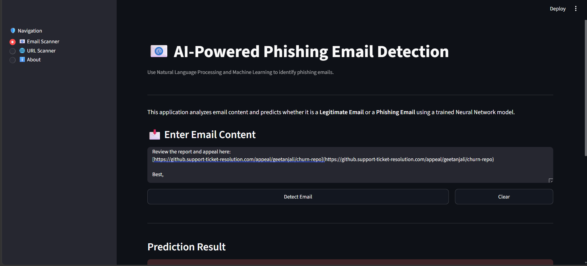

#  PhishGuard AI
### AI-Powered Phishing Email & Malicious URL Detection with Explainable AI

<p align="center">
  
</p>

<p align="center">
  
  
  
  
  
  
</p>

---

##  Overview

PhishGuard AI is an intelligent cybersecurity platform designed to detect phishing emails and malicious URLs before users become victims of cyberattacks.

Unlike traditional phishing filters that simply classify content, PhishGuard AI combines **Machine Learning, Natural Language Processing (NLP), Heuristic URL Analysis, and Generative AI** to provide both accurate predictions and clear explanations. Users not only learn whether an email or URL is suspicious but also understand *why* it has been flagged and how to stay safe.

---

##  Problem Statement

Phishing attacks continue to be one of the leading causes of credential theft, financial fraud, and organizational security breaches. Modern phishing emails increasingly use AI-generated content and sophisticated social engineering techniques, making them difficult to detect using traditional rule-based filters.

There is a growing need for an intelligent solution that can analyze emails and URLs in real time while providing transparent explanations that help users recognize cyber threats.

---

##  Solution

PhishGuard AI delivers an end-to-end phishing detection system that combines multiple AI techniques into a single, user-friendly application.

The platform can:

- Detect phishing emails using NLP and Machine Learning
-  Analyze URLs using heuristic-based security checks
-  Generate an easy-to-understand risk score
-  Explain every prediction using Generative AI
-  Recommend security actions to users
-  Provide an interactive web interface using Streamlit

---

# System Workflow

```
                User Input
          ┌─────────────────┐
          │ Email or URL    │
          └────────┬────────┘
                   │
                   ▼
        Data Preprocessing (NLP)
                   │
                   ▼
       Feature Extraction (TF-IDF)
                   │
         ┌─────────┴──────────┐
         ▼                    ▼
 Email ML Model         URL Heuristics
         │                    │
         └─────────┬──────────┘
                   ▼
          Risk Score Generator
                   │
                   ▼
        Explainable AI (Gemini)
                   │
                   ▼
    Prediction + Explanation + Recommendation
```

---

# Features

###  AI Email Scanner

- NLP-based preprocessing
- TF-IDF Vectorization
- Neural Network Classification
- Confidence Score
- Real-time prediction

---

###  URL Scanner

- HTTPS verification
- Suspicious keyword detection
- IP address detection
- URL length analysis
- Special character analysis
- Risk calculation

---

###  Explainable AI

Instead of only displaying:

>  Phishing Detected

PhishGuard AI also explains:

- Why the URL was flagged
- Suspicious indicators found
- Risk level
- Security recommendations
- Safe next actions

---

###  Interactive Dashboard

- Clean Streamlit UI
- Confidence visualization
- Risk meter
- AI explanation panel
- Responsive design

---

#  Technology Stack

| Category | Technologies |
|----------|--------------|
| Programming | Python |
| Frontend | Streamlit |
| Machine Learning | TensorFlow, Keras, Scikit-Learn |
| NLP | NLTK, TF-IDF |
| AI | Google Gemini API |
| Model Storage | Joblib |
| Version Control | Git & GitHub |

---

#  Project Structure

```
PhishGuard-AI/

│── Models/
│     ├── phishing_email_model.keras
│     ├── tfidf_vectorizer.pkl
│
│── Images/
│
│── app.py
│── url_scanner.py
│── heuristic_engine.py
│── gemini_explainer.py
│── requirements.txt
│── README.md
```
---
#  Installation

Clone the repository

```bash
git clone https://github.com/geetanjalik01/PhishGuard-AI.git
```

Move into project

```bash
cd PhishGuard-AI
```

Install dependencies

```bash
pip install -r requirements.txt
```

Run the application

```bash
streamlit run app.py
```

---

#  Environment Variables

Create a `.env` file in the project root.

```
GEMINI_API_KEY=YOUR_API_KEY
```

---

#  Future Enhancements

- Browser Extension (Chrome & Edge)
- Gmail Integration
- Outlook Plugin
- WHOIS Domain Intelligence
- QR Code Phishing Detection
- Attachment Malware Analysis
- Enterprise Dashboard
- Threat Intelligence APIs
- Multilingual Phishing Detection

---

#  Real-World Applications

Personal Email Protection

Enterprise Security

Banking & FinTech

Educational Institutions

Government Organizations

Cybersecurity Awareness

---

#  License

This project is licensed under the MIT License.

---

# Developer

**Geetanjali Kanwar**

B.Tech Information Technology  
National Institute of Technology (NIT) Raipur
